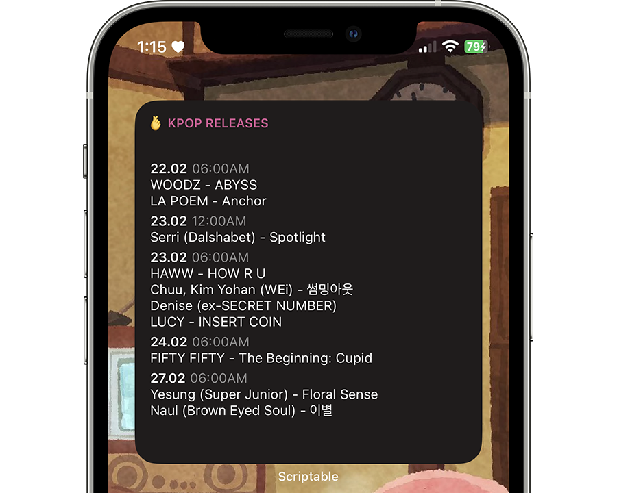
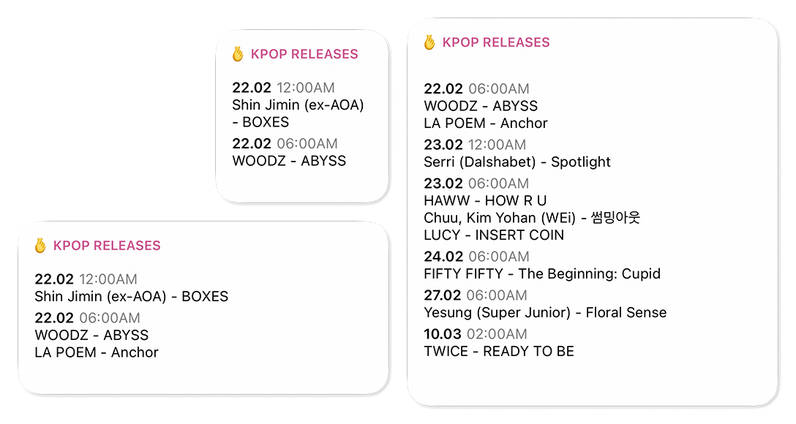
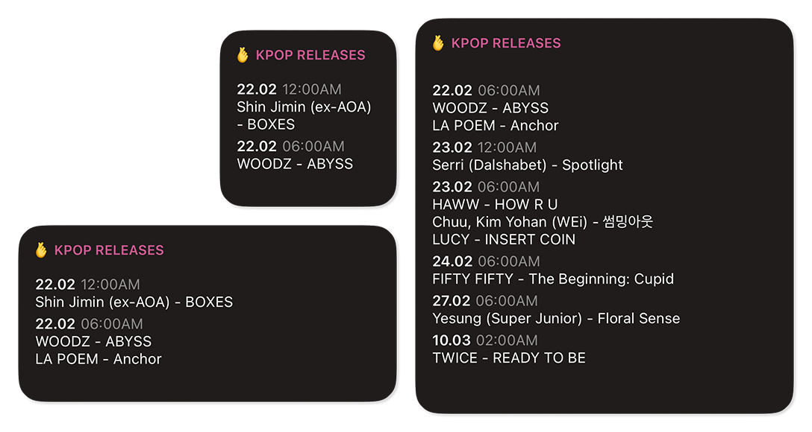

# KPop Releases Widget for Scriptable

Stay up to date with the latest KPop releases by using this widget

## Preview

## Features
* Dark Mode Support
* Show the release date and time based on your iOS device configuration
* No matter the size of your widget, open it to see more releases
* Updates daily without needing to do anything
* Easy access from your homescreen

## How to Install & Use

1. Install [Scriptable](https://scriptable.app) from App Store
2. Download the widget from [this link](https://www.heismauri.com/assets/scriptable/KPop%20Releases.scriptable)
3. Open the downloaded file
4. Click the *Add to My Scripts* button at the bottom
5. Add a *Scriptable* widget to your homescreen, and select the size you would like
6. Tap the recently created widget, on **Script** select *KPop Releases*, and on **When Interacting** select *Run Script*
7. You're all set!

## Acknowledgements
* [r/kpop](https://www.reddit.com/r/kpop/)
* [Scriptable](https://scriptable.app/)
